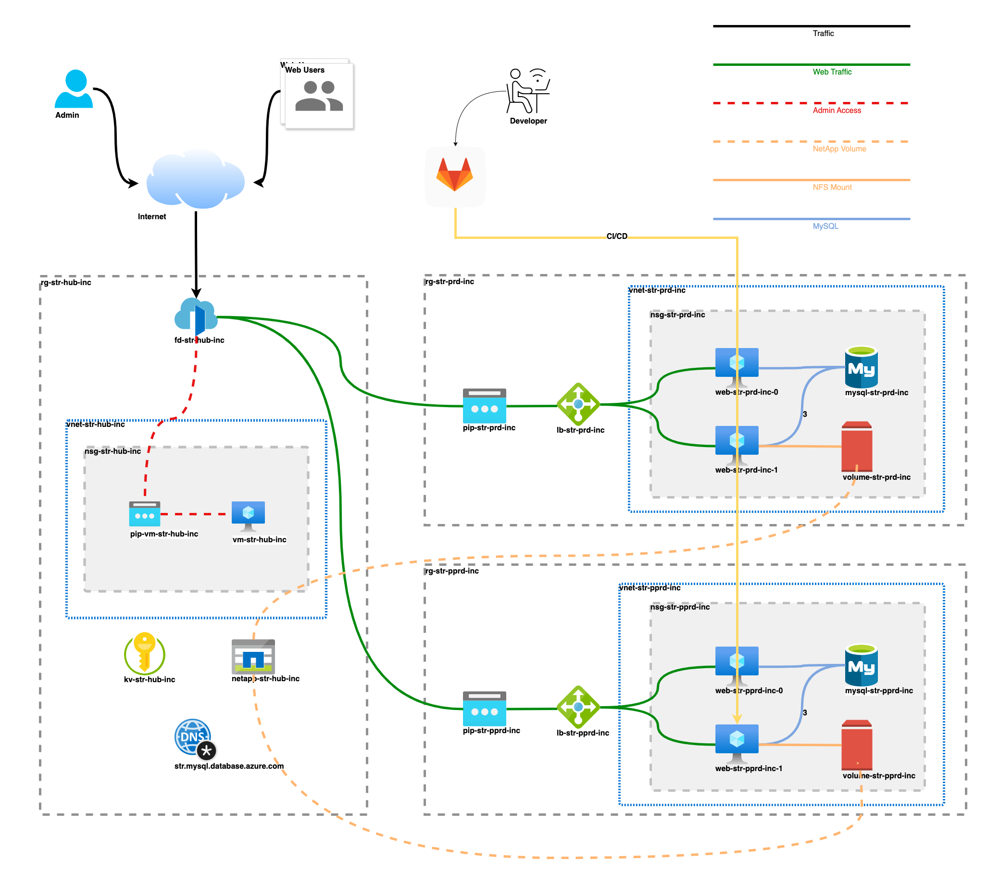

# Shared Hosting Platform on Azure

## Introduction
I've had the exciting opportunity to design and build a shared hosting platform on Azure.
The base requirement was to host websites built on a PHP CMS (e.g., WordPress) on a LAMP (Linux, Apache, MySQL, PHP) stack, while supporting multiple PHP versions.

In addition to these requirements, I focused on:

- Secured Architecture
- Network Load Balancing with SSL/TLS - Termination
- High Availability of Web Servers
- PaaS Solution for MySQL
- Code Repository & CI/CD
- Code Quality
- Platform Administration

I want to share my journey with the tech community. Through a series of posts, I’ll walk you through each phase of the project.

### Topics Covered
- [Shared Hosting Platform Architecture](./Part_1.md)
- [Terraform – Deploying Azure Infrastructure](./Part_2.md)
- [Bash Scripts - Server Preparation Guide for Web Hosting](./Part_3.md)
- [Ansible – Configuring Web and Database Servers](./Part_4.md)
- [Jenkins – Admin Portal for Management](./Part_5.md)

### Upcoming Topics
- [GitLab CI/CD – Automating Deployments](./Part_6.md)
- [ELK Stack – Monitoring and Logging](./Part_7.md)

Stay tuned for detailed guides and insights! 🚀
